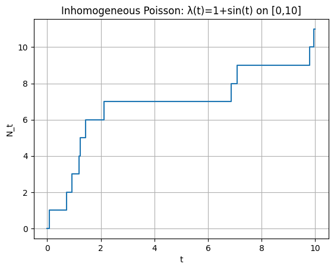
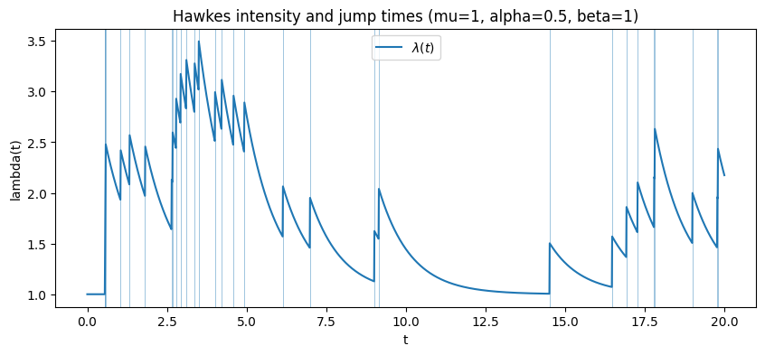
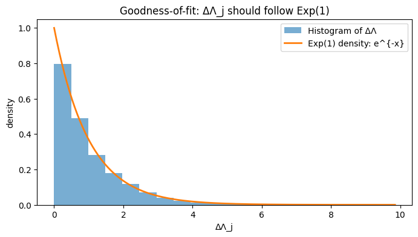

# Point Process Simulation and Inference

This project studies the simulation and statistical analysis of point processes. It
covers homogeneous and non-homogeneous Poisson processes, renewal processes, and
self-exciting Hawkes processes through two course assignments.

## Topics covered

- simulation from exponential inter-arrival times;
- fixed-horizon Poisson trajectories and discrete observations;
- renewal processes with alternative waiting-time distributions;
- thinning for a non-homogeneous Poisson process;
- simulation of exponential Hawkes processes;
- conditional intensity and compensator calculations;
- time-rescaling goodness-of-fit diagnostics;
- maximum-likelihood estimation of Hawkes parameters;
- optional application to a Memetracker event cascade.

## Selected results

### Non-homogeneous Poisson process

The intensity $\lambda(t)=1+\sin(t)$ is simulated by thinning a homogeneous Poisson
process with dominating rate 2.



### Hawkes conditional intensity

Each event produces an instantaneous increase in intensity, followed by exponential
decay toward the baseline level.



### Time-rescaling diagnostic

For the simulated Hawkes process, the transformed inter-event intervals closely follow
an $\mathrm{Exp}(1)$ distribution. In the recorded run, their empirical mean was 0.994
and the Kolmogorov–Smirnov test returned a p-value of 0.901.



## Repository structure

```text
.
├── notebooks/
│   ├── 01_poisson_renewal_nhpp_simulation.ipynb
│   └── 02_hawkes_simulation_estimation.ipynb
├── figures/
├── data/
│   └── README.md
├── requirements.txt
└── README.md
```

The first notebook focuses on Poisson, renewal, and non-homogeneous processes. The
second develops the Hawkes workflow from simulation to likelihood-based estimation and
model checking.

## Installation

```bash
git clone https://github.com/YOUR-USERNAME/point-processes-simulation-inference.git
cd point-processes-simulation-inference
python -m venv .venv
source .venv/bin/activate
pip install -r requirements.txt
jupyter notebook
```

## Optional data

The Memetracker experiment requires `clust-qt08080902w3mfq5.txt`. Place it in `data/`
to run the final section of the Hawkes notebook. The notebook skips this section cleanly
when the file is unavailable.

## Course context

Developed as part of an M2 Applied Mathematics course on estimation for jump processes
at Sorbonne Université (2025). The repository contains the completed analysis, not the
course notes or blank assignment template.
